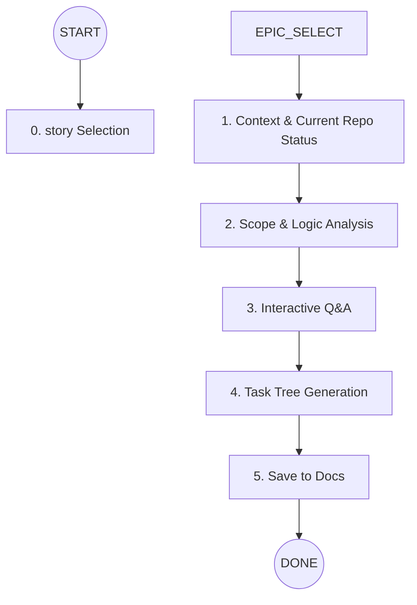

# Story Breakdown Roadmap

Your goal is to transform a high-level Story into a granular, implementable task list focusing on logic, patterns, and files—not management fluff, using all infomation to address impactor, reference for exmple template , reference for unstand old code before implementable

## 🗺️ The Breakdown Path



---

## 🛤️ Instruction Nodes

### 0. Epic Selection (MANDATORY FIRST STEP)

**⛔ CRITICAL: You MUST complete this step before doing ANYTHING else.**

**Action**:
1. Scan `docs/epics/` folder for existing epic files (`.md` files)
2. Present options to user in this format:

```
📋 **Select an Epic to Break Down**

**Existing Epics:**
┌────┬─────────────────────────────┐
│ #  │ Epic Name                   │
├────┼─────────────────────────────┤
│ 1  │ user-authentication         │
│ 2  │ inventory-management        │
│ 3  │ ...                         │
└────┴─────────────────────────────┘

**Options:**
- Type a number (e.g., `1`) to select an existing epic
- Type a new epic name (e.g., `payment-integration`) to create new

👉 **Your choice:**
```

3. **⛔ STOP AND WAIT** for user response
4. If user provides argument `$ARGUMENTS`, use that as epic name directly
5. Confirm the selected epic before proceeding:
   - `✅ Epic selected: {epic-name}`
   - `📄 File: docs/epics/{epic-name}.md`

**Rules**:
- **NEVER proceed** without confirmed epic name
- If `docs/epics/` doesn't exist, ask user to provide epic name
- If epic file doesn't exist, ask if user wants to create it first

---

### 1. Context & Current Repo Status (Repo-First)
**Goal:** Ground everything in the actual repo so tasks do not hallucinate or assume patterns.

**Action:**
* Read the story file: `docs/stories/{story-file}.md`
* Scan repo for relevant code paths mentioned in the story (BE/FE/worker/storage)
* Locate existing similar patterns and templates before proposing changes
* Read project conventions:
    * `AGENTS.md` (if present)
    * `.claude/skills/` (if present)

**Output:**
A brief “Current Repo Status” summary:
* Language/framework (proven by repo files)
* DB + schema tooling (proven by repo)
* API style + routing patterns (proven by repo)
* Key modules & entry points for this story (paths)
* Closest example implementations to copy (paths)
* Constraints found (types, configs, migrations, workers)

**Rules:**
* Never guess the stack or architecture
* If evidence is missing, mark as Unknown and ask in Step 3 (not now)

---

### 2. Scope & Logic Analysis (Before/After + why)
You MUST analyze both before and after behavior, and write reasoning that devs can trust.

**Analyze:**
* **Before change (Current behavior)**
    * Current flow steps
    * Current data shape / DB fields
    * Current API/UI behavior
    * Current constraints and limitations
    * Evidence: file references proving each key claim
* **After change (Target behavior)**
    * New flow steps (success + failure paths)
    * New/changed data shape
    * New/changed API/UI behavior
    * Backwards compatibility and non-goals
* **Why this way (decision logic)**
    * Why this approach matches repo conventions
    * Why this way is safer / simpler than alternatives
    * What alternatives exist and why they are worse in this repo
    * Record this reasoning for developers (not business)
* **Risks and how to avoid them**
    * Migration risks, regression risks, concurrency timing, permissions, storage cleanup
    * Mitigation actions (tests, gating, order of operations)

**Rule:** Ignore time/hours. Focus on implementation logic and correctness.

---

### 3. Interactive Q&A (Wait for User)
**Action:** Present 3–5 critical questions based on repo scan + analysis.

**Batches (group the questions):**
* Logic (behavior choices, edge cases)
* Integration (API contracts, storage keys, worker pipeline, ordering)
* Testing (backend tests mandatory; ask if E2E needed)

**Hard Gate:**
* ⛔ **STOP:** You MUST wait for user answers before proceeding to Task Tree.

**Rules:**
* Ask only questions that remain unclear after reading the repo/story
* Prefer multiple choice
* One batch message only (max 3–5 questions)

---

### 4. Task Tree Generation (MAX 20 TASKS)
**Focus:** Actionable code steps. No “HR” time estimates (hours/days).

**Phase Priority:**
* Default: BE → BE-TEST → FE (ask user preference if they want FE first)
* E2E optional (only if user requests)

**Dependency:**
* Foundation ➜ Core ➜ Integration ➜ Test ➜ FE wiring

**Format:** For each task (ALL fields are mandatory):
* **ID:** T{NNN}
* **Action:** Clear verb (e.g., "Create", "Modify", "Integrate")
* **Business Summary:** 1–2 lines on the outcome/value (dev-friendly)
* **Logic:** What needs to be done and why (plain language)
* **Technical Logic:** Key technical approach, constraints, algorithms
* **Risk & Avoidance:** What can break and how to prevent it
* **Testing:** Required test scope (backend tests mandatory, E2E optional) (if no need write no need)
* **State:** pending | in_progress | done
* **Files:** Specific paths to create/modify
* **Patterns:** Reference existing files as examples to follow conventions
* **Reference:** Reference existing files exmaple same implement in the history
* **Reference Skill:** Reference skill using for the task in @.calude/skill (can pick muti skill - think carefuly before pick)
* **Skill Picker:** List the skills the agent must use for this task (e.g., Read/Glob/Write/Edit + any relevant repo skills)
* **Mermaid (After):** Diagram showing how the system works after this task is done (MANDATORY)

**Mermaid requirement:**
Every task must include a mermaid chart that helps the next agent/dev understand the codebase impact. It can be sequenceDiagram, flowchart, or graph TD, but it must show:
* who calls who
* where data moves
* what changed after this task

---

### 5. Persistence (Save to Docs)
**Structure:** Save to `docs/breakdowns/{story-slug}/`

* **SUMMARY.md**
    * Repo context summary
    * Before/After analysis
    * Decisions + Q&A answers
    * Full Task Tree (with links to each task file)
* **tasks/**
    * Individual .md files for each task (T001-*.md, T002-*.md, ...)
* **progress.md**
    * Ongoing status log per task
    * Update after each task

**Task file requirements (docs/breakdowns/{story-slug}/tasks/TNNN-*.md):**
* Must include the same mandatory fields as Task Tree
* Must include a mermaid diagram (after task done)

## 🚦 Execution Rules

| # | Rule |
|---|------|
| 0 | **Epic Selection is MANDATORY** - Never skip Step 0 |
| 1 | **No Management Fluff** - Skip "hours", "days", or "sizing" |
| 2 | **Pattern-First** - Every task must reference existing code patterns |
| 3 | **Interactive Mandatory** - Cannot generate tasks until Q&A is confirmed |
| 4 | **Context Persistence** - Record all decisions in `SUMMARY.md` |
| 5 | **Testing Required** - Backend tests mandatory, E2E optional |
| 6 | **User Verification Gate** - Wait for user after each major step |
| 7 | **Progress Logging** - Update `progress.md` after each task |
| 8 | **State-Gated Picking** - Only pick tasks not marked `done` |

---
