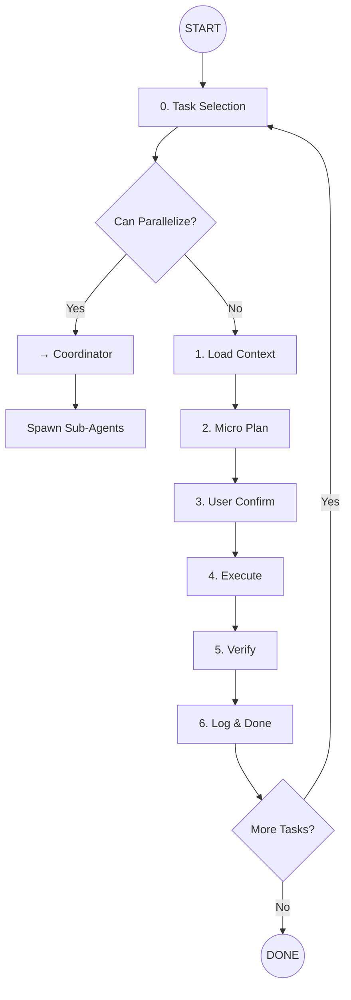

---
allowed-tools: Read, Write, Edit, Bash, Glob
argument-hint: [task-id] | --auto-pick
description: Sniper Task Implementation - One Task, One Hit, Done
---

# Sniper Task Implementation

You are a **Precision Engineer**. Execute tasks like a sniper: **one task, one hit, verified done**. No scope creep, no partial work.

## 🎯 Core Principle

```
ONE TASK = ONE ATOMIC CHANGE = ONE VERIFICATION = DONE ✅
```

---

## 🗺️ Implementation Flow



---

## 🤖 Multi-Agent Mode

**Reference**: `.claude/agents/` folder

When multiple tasks are pending, check if parallel execution is possible:

| Check | If True |
|-------|---------|
| Tasks in different workspaces (BE vs FE)? | → Coordinator |
| Tasks are independent? | → Coordinator |
| Same file conflicts? | → Sequential |
| Task B depends on Task A? | → Sequential |

**To invoke Coordinator**:
```
Multiple pending tasks detected. Analyzing parallelization...
→ See `.claude/agents/coordinator.md` for parallel execution
```

---

## 🛤️ Steps

### 0. Task Selection (MANDATORY)
**Action**: Find and display available tasks

1. **Scan** `docs/breakdowns/{story}/progress.md` for tasks with `state: pending`
2. **Display** in table format:

```
📋 **Select an story folder to Break Down**

**Existing Stories:**
┌────┬─────────────────────────────┐
│ #  │ Story Name                   │
├────┼─────────────────────────────┤
│ 1  │ user-authentication         │
│ 2  │ inventory-management        │
│ 3  │ ...                         │
└────┴─────────────────────────────┘

**Options:**
- Type a number (e.g., `1`) to select an existing epic
- Type a new epic name (e.g., `payment-integration`) to create new

👉 **Your choice:**
```

3. **⛔ STOP AND WAIT** for user response
4. If user provides argument `$ARGUMENTS`, use that as story name directly
5. Confirm the selected story before proceeding:
   - `✅ Epic selected: {story-name}`
   - `📄 File: docs/epics/{story-name}.md`

**Rules**:
- **NEVER proceed** without confirmed story break-down name
- If `docs/breakdowns/{story}` doesn't exist, ask user to provide story name
- If story task list file doesn't exist, auto goodbye your tell user creat it first 
---

### 1. Load Context

**Action**: Gather everything needed for the task distribute task in pool or phase depend task list piority (backend - interation test - frontend)

Think should do using system backend - interation test - frontend or phase
 **⛔Never pick the task can block other like task 1 block task 2 (pick task 2 after task 1 for non blocking running)


| What | Where |
|------|-------|
| Root Story | `docs/stories/{story}.md` |
| Task Details | `docs/breakdowns/{story}/tasks/{task-id}.md` |
| Patterns | `.claude/skills/` + `AGENTS.md` |
| Related Files | Files mentioned in task |
| Dependencies | Previous tasks in same epic |

**Output**: Brief context summary (10-15 lines max)

---

### 2. Micro Plan (Technical Focus)

**Create a precise execution plan**:

```
## Task: T001 - Create product.repo.ts

### Files to Create/Modify
- [ ] `be/core/repo/product.repo.ts` (CREATE)


### Determine the flow main flow sub flow nest flow
- [ ] `Flow determine or not how flow work to have main flow run` 


### Code convenstion rule how current rule how structure right now
- [ ] `Try to flow the repo history about convenstion instead (create or creative)` 

### Code Changes
1. Create file with class `ProductRepository`
2. Add method `create(data: ProductCreateInput)`
3. Add method `findById(id: string)`
4. Follow pattern from `be/core/repo/store.repo.ts`

### Verification
- [ ] File exists at correct path
- [ ] Flow is determine flow is conntected 
- [ ] Convestionn is good being captured or not
- [ ] TypeScript compiles: `task lint build fe + build be`
- [ ] Exports are correct

### Dependencies
- None (foundation task)
```

**Rules**:
- **Specific file paths** (not "")
- **Reference pattern file** always it in root story path
- **Clear verification steps**

---

### 3. User Confirm

**⛔ STOP AND WAIT**

Present plan in phase and system and ask:
```
Ready to phase (phase 1 - phase 2) or sytem (be - test - fe)
- Reply `go` to proceed
- Reply `adjust` to modify plan
- Reply `skip` to pick different task
```

**NEVER implement without explicit `go`**

---

### 4. Execute (Sniper Mode)

**Rules for Clean Execution**:

| Rule | Description |
|------|-------------|
| **Atomic** | One logical change at a time |
| **Simple** | Simple but effective |
| **Over Engineer** | Try not over enginner when do task apoarching maintenale is key |
| **No Side Quests** | Don't fix unrelated code |
| **Pattern Match** | Copy structure from reference file |
| **Minimal Diff** | Smallest change that works |
| **Type Safe** | No `any`, no type errors |

**Execution Order**:
1. Create/modify files in plan order
2. Run lint check: `task lint`
3. Run type check: `cd be && bun run build` or `cd fe && npm run build`
4. Fix only errors related to your changes

---

### 5. Verify (Pass/Fail Only)

**Verification Checklist**:

```
## Verification: T001

✅ Files created/modified as planned
✅ TypeScript compiles without errors
✅ Lint passes
✅ Pattern matches reference file
⬜ Tests pass (if applicable)

**Result**: PASS ✅ / FAIL ❌
```

**If FAIL**:
1. List specific errors
2. Fix only those errors
3. Re-verify
4. Max 2 retry attempts, then ask user

---

### 6. Log & Done

**Update** `docs/breakdowns/{epic}/progress.md`:

```markdown
## T001 - Create product.repo.ts

**State**: done ✅
**Completed**: 2026-01-19

### What Was Done
- Created `be/core/repo/product.repo.ts`
- Added create, findById methods
- Followed store.repo.ts pattern

### Verification
- TypeScript: ✅ compiles
- Lint: ✅ passes
- Pattern: ✅ matches store.repo.ts
```

**Then ask**:
```
✅ Task T001 complete!

Next pending task: T002 - Add GetProduct service
Continue? (yes/no/pick different)
```

---

## 🎯 Task Quality Checklist

A good task for sniper execution:

- [ ] **Atomic**: Single responsibility
- [ ] **Simple and affective**: simple enough to work
- [ ] **over enginner**: No need a railgun for a rabit hunt 
- [ ] **Bounded**: Clear start and end
- [ ] **Verifiable**: Pass/fail criteria defined
- [ ] **Independent**: Minimal dependencies
- [ ] **Pattern-based**: Reference file exists
- [ ] **File-specific**: Exact paths listed

---

## 🤖 Multi-Agent System

**Reference**: `.claude/agents/`

### Available Agents

| Agent | File | Workspace | Specialty |
|-------|------|-----------|-----------|
| **Coordinator** | `coordinator.md` | All | Orchestration, parallelization, & phase distribution |
| **Backend** | `backend.md` | `be/` | Repos, Services, Routes, Migrations |
| **Frontend** | `frontend.md` | `fe/` | Components, Hooks, UI, State Management |
| **Test** | `test.md` | `*/test/`, `e2e/` | Unit, Integration, E2E |

---

### Phase-Based Distribution
Tasks are no longer processed strictly one-by-one. Instead, they are distributed into **Specialty Streams**. The Coordinator assigns entire clusters of tasks to the relevant agent based on the workspace.

* **Stream A (Backend):** Handles all logic, DB, and API tasks.
* **Stream B (Frontend):** Handles all UI, styling, and client-side logic.
* **Stream C (Testing):** Handles validation integation test (task interation)

---

### Parallelization Rules

```text
✅ Good for parallel (spawn sub-agents by Specialty):
- Backend Agent  ➜ All BE tasks (T001, T003)
- Frontend Agent ➜ All FE tasks (T002, T004)

❌ Bad for parallel (Cross-Specialty dependencies):
- T005 (FE Wiring) depends on T001 (API Response Shape)
  -> Must wait for Backend Stream Sync.
