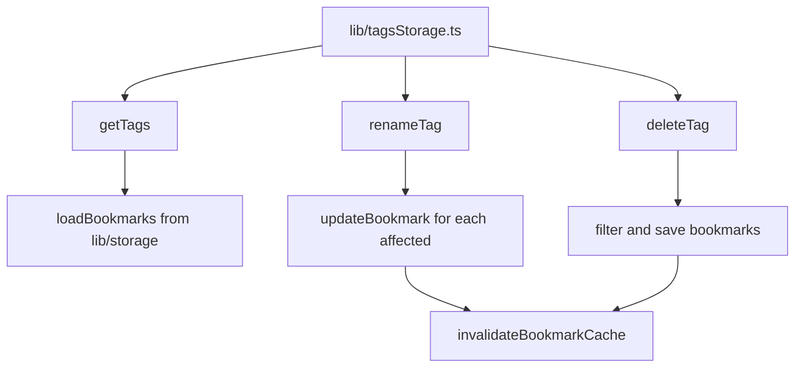

# T001: Create Tag Storage Module

**Action:** Create  
**Business Summary:** Create `lib/tagsStorage.ts` to manage tag operations (get, rename, delete) with centralized logic.

## Logic

Need a storage module that reads bookmarks, extracts tags with counts, and provides bulk update functions. Must follow existing storage module pattern with in-memory cache invalidation.

## Technical Logic

- `getTags()`: Load bookmarks, iterate to extract all tags with counts, return sorted array `{ name, count }[]`
- `renameTag(oldName, newName)`: Load bookmarks, map through, replace exact tag match, save all
- `deleteTag(name)`: Load bookmarks, filter out tag from arrays, save all
- All functions call `invalidateBookmarkCache()` from `lib/storage.ts`
- Validation: max 50 chars, not empty, no duplicate names

## Risk & Avoidance

| Risk | Mitigation |
|------|------------|
| Cache staleness | Always call `invalidateBookmarkCache()` before/after writes |
| Performance | Single read + single write for bulk operations |

## Testing

Unit tests for getTags (counts), renameTag (exact match), deleteTag (removal)

## State

pending

## Files

- `lib/tagsStorage.ts` (new)

## Patterns

- `lib/storage.ts:17-29` - in-memory cache pattern
- `lib/spacesStorage.ts` - storage module pattern (follow same exports)

## Reference

`lib/bookmarks.ts:11-17` - `getUniqueTags()` logic for reference

## Reference Skill

localstorage-crud

## Skill Picker

Read/Write - Read existing storage modules, write new tagsStorage

## Mermaid (After)

