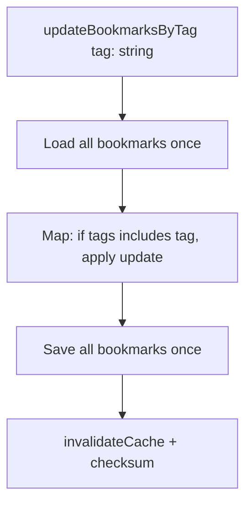

# T002: Modify Bookmark Update Function for Bulk Tag Updates

**Action:** Modify  
**Business Summary:** Add helper function to update multiple bookmarks efficiently for tag rename/delete operations.

## Logic

Need a function that updates all bookmarks matching a condition in a single write, to avoid N+1 writes and race conditions.

## Technical Logic

- Add `updateBookmarksByTag()` to `lib/storage.ts` or `tagsStorage.ts`
- Takes tag name, update function (replace tag), returns updated bookmarks
- Loads bookmarks once, maps through, saves once
- Calls `invalidateBookmarkCache()` once after all updates

## Risk & Avoidance

| Risk | Mitigation |
|------|------------|
| Partial updates | Single load + single save ensures atomicity |
| Race conditions | Existing storage event listeners handle multi-tab sync |

## Testing

Test with bookmarks having multiple tags (should only affect matching tag)

## State

pending

## Files

- `lib/storage.ts` or `lib/tagsStorage.ts` (modify)

## Patterns

- `lib/storage.ts:178-189` - `updateBookmark()` for single bookmark
- `lib/storage.ts:191-198` - `setBookmarks()` for bulk set

## Reference

`lib/bookmarks.ts:19-22` - `filterByTag()` for tag matching logic

## Reference Skill

localstorage-crud

## Skill Picker

Read/Edit - Read storage.ts, edit to add helper function

## Mermaid (After)

