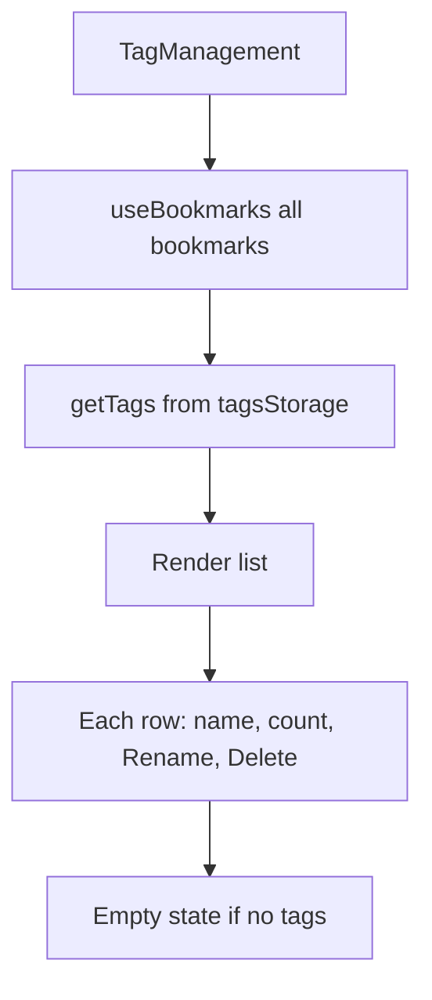

# T004: Create Tag List Component

**Action:** Create  
**Business Summary:** Build `TagManagement.tsx` showing all tags with counts and action buttons.

## Logic

Main component displaying tags in a list, with search/filter, counts, and action buttons. Uses `useBookmarks` to get data, `tagsStorage.ts` for operations.

## Technical Logic

- `useBookmarks("")` to get all bookmarks
- Call `getTags()` from `tagsStorage.ts` to get `{ name, count }[]`
- Render list with: tag name, count badge, Rename button, Delete button
- Sort alphabetically by default
- Empty state: "No tags yet. Add tags to bookmarks first."

## Risk & Avoidance

| Risk | Mitigation |
|------|------------|
| Stale data | Listen for bookmark changes via BookmarksContext or use `useDataRefreshStore` |
| Loading state | Handle initial load |

## Testing

Manual - verify counts match actual bookmark tag usage

## State

pending

## Files

- `components/tags/TagManagement.tsx` (new)
- `components/tags/` directory

## Patterns

- `components/settings/ThemeSettings.tsx:35-100` - Settings component pattern
- `components/bookmarks/TagInput.tsx:36-185` - Tag-related UI patterns

## Reference

`lib/bookmarks.ts:11-17` - `getUniqueTags()` for tag extraction

## Reference Skill

bookmark-patterns

## Skill Picker

Read/Write - Read ThemeSettings, write TagManagement

## Mermaid (After)

