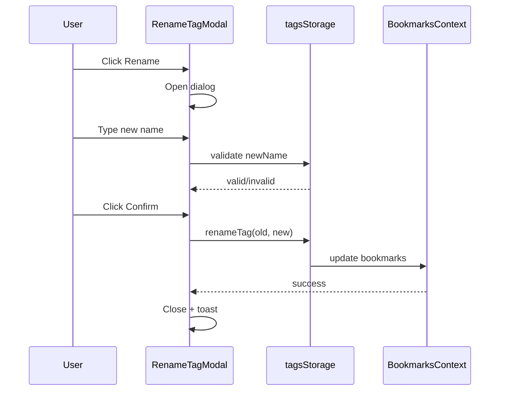

# T005: Create Rename Tag Modal

**Action:** Create  
**Business Summary:** Build `RenameTagModal.tsx` dialog for renaming tags with validation and preview.

## Logic

Modal that opens when clicking Rename, shows current name, new name input, affected bookmarks preview, and Confirm button.

## Technical Logic

- Props: `isOpen`, `onClose`, `tagName`, `onRename`
- Validation: non-empty, max 50 chars, no existing tag with new name
- Preview: show "X bookmarks will be updated" count
- Actions: Confirm calls `renameTag()` from `tagsStorage.ts`, shows toast, closes modal
- Use existing Dialog component from `components/ui`

## Risk & Avoidance

| Risk | Mitigation |
|------|------------|
| Duplicate names | Check against `getTags()` before confirming |
| Case sensitivity | Exact match check (per Q&A answer) |

## Testing

Manual - rename validation, preview count accuracy

## State

pending

## Files

- `components/tags/RenameTagModal.tsx` (new)

## Patterns

- `components/bookmarks/TagInput.tsx:36-185` - Dialog/form patterns
- `components/ui/Dialog.tsx` - UI primitive

## Reference

`lib/tagsStorage.ts` - renameTag function signature

## Reference Skill

bookmark-patterns

## Skill Picker

Read/Write - Read UI primitives, write modal

## Mermaid (After)

