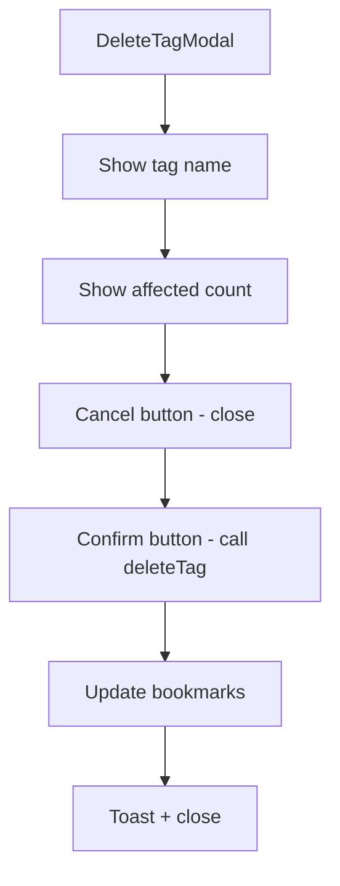

# T006: Create Delete Tag Modal

**Action:** Create  
**Business Summary:** Build `DeleteTagModal.tsx` confirmation dialog showing affected bookmarks count.

## Logic

Modal that opens when clicking Delete, shows confirmation message with affected count, and Confirm/Cancel buttons.

## Technical Logic

- Props: `isOpen`, `onClose`, `tagName`, `affectedCount`, `onDelete`
- Message: "Delete tag '{tagName}'? It will be removed from {count} bookmarks."
- Confirm calls `deleteTag()` from `tagsStorage.ts`, shows toast, closes modal
- Delete allowed regardless of count (per Q&A answer)

## Risk & Avoidance

| Risk | Mitigation |
|------|------------|
| Accidental deletion | Confirmation required, clear message |
| Count accuracy | Use same `getTags()` logic to calculate count |

## Testing

Manual - delete confirmation, affected count accuracy

## State

pending

## Files

- `components/tags/DeleteTagModal.tsx` (new)

## Patterns

- `components/tags/RenameTagModal.tsx` - Similar structure
- `components/ui/AlertDialog.tsx` or Dialog - UI primitive

## Reference

`lib/tagsStorage.ts` - deleteTag function signature

## Reference Skill

bookmark-patterns

## Skill Picker

Read/Write - Read modal patterns, write DeleteTagModal

## Mermaid (After)

