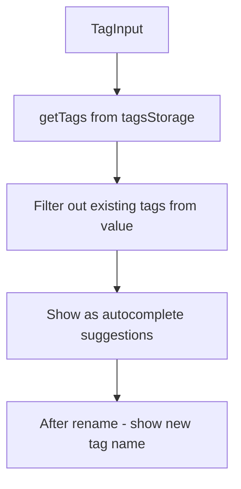

# T008: Update TagInput with Dynamic Suggestions

**Action:** Modify  
**Business Summary:** Update `TagInput.tsx` to use `getTags()` for autocomplete suggestions.

## Logic

TagInput currently receives `suggestions` prop. Need to make it call `getTags()` to get current tag names dynamically.

## Technical Logic

- Change `suggestions` from prop to computed via `getTags()` from `tagsStorage.ts`
- Or add a `useTags()` hook that returns unique tags
- This ensures suggestions update after rename/delete operations

## Risk & Avoidance

| Risk | Mitigation |
|------|------------|
| Performance | `getTags()` reads from cache, should be fast |
| Empty suggestions | Handle no tags case |

## Testing

Manual - verify autocomplete shows renamed tags, doesn't show deleted tags

## State

pending

## Files

- `components/bookmarks/TagInput.tsx` (modify)

## Patterns

- `components/bookmarks/TagInput.tsx:31` - suggestions prop
- `lib/bookmarks.ts:11-17` - `getUniqueTags()` logic

## Reference

`lib/tagsStorage.ts` - getTags function with counts

## Reference Skill

localstorage-crud

## Skill Picker

Read/Edit - Read TagInput, edit to use getTags

## Mermaid (After)

