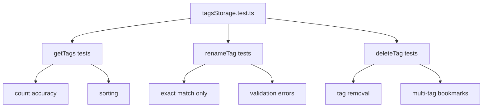

# T009: Unit Tests for Tag Storage

**Action:** Create  
**Business Summary:** Write unit tests for `tagsStorage.ts` functions (getTags, renameTag, deleteTag).

## Logic

Tests that verify correct behavior of tag operations with mock bookmark data.

## Technical Logic

- Test file: `lib/tagsStorage.test.ts` (or `__tests__` folder)
- Mock `localStorage` using `vi.fn()` from Vitest
- Test cases:
  - `getTags()` returns correct counts
  - `renameTag()` updates only exact matches
  - `renameTag()` rejects empty/duplicate names
  - `deleteTag()` removes tag from all bookmarks
  - Edge: bookmarks with multiple tags
  - Edge: tag with count=0

## Testing

Unit tests for all public functions in tagsStorage

## State

pending

## Files

- `lib/tagsStorage.test.ts` or `__tests__/tagsStorage.test.ts` (new)

## Patterns

- Existing test patterns in project

## Reference

`lib/storage.ts:27-29` - `__resetCacheForTesting` for test reset

## Reference Skill

bookmark-checker

## Skill Picker

Read/Write - Read existing tests, write tag storage tests

## Mermaid (After)

