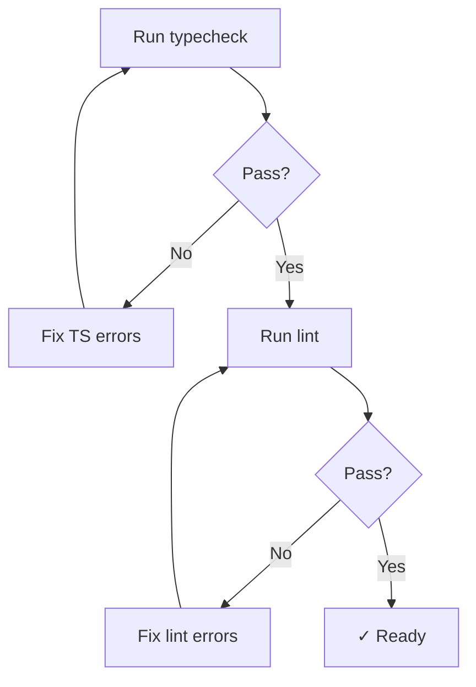

# T010: Run Lint and Typecheck

**Action:** Run  
**Business Summary:** Run lint and typecheck to ensure code quality.

## Logic

Verify all TypeScript types compile and ESLint passes.

## Technical Logic

- `npm run typecheck` or `tsc --noEmit`
- `npm run lint` or `eslint .`

## Risk & Avoidance

| Risk | Mitigation |
|------|------------|
| Type errors | Fix any TypeScript errors before proceeding |
| Lint errors | Fix ESLint warnings/errors |

## Testing

N/A - verification step

## State

pending

## Files

N/A - verification

## Patterns

N/A

## Reference

N/A

## Reference Skill

bookmark-checker

## Skill Picker

Bash - Run lint/typecheck commands

## Mermaid (After)

